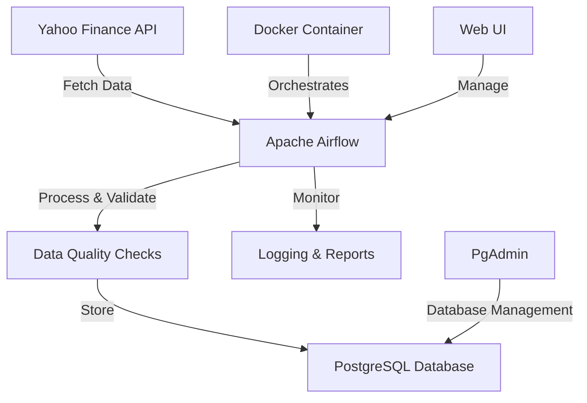

# 📈 Yahoo Finance Stock Data Pipeline

> **A production-ready, automated data pipeline for fetching, processing, and storing stock market data using Apache Airflow, PostgreSQL, and Yahoo Finance API**


## 🎯 Project Overview

This project demonstrates a **complete ETL (Extract, Transform, Load) pipeline** that automatically fetches stock market data from Yahoo Finance, processes it, and stores it in a PostgreSQL database. Built with industry best practices, this pipeline showcases skills essential for **Data Engineering**, **DevOps**, and **Financial Technology** roles.

### 🌟 Key Highlights

- **🔄 Automated Data Pipeline**: Runs daily to fetch fresh stock market data
- **🏗️ Production Architecture**: Uses Apache Airflow for orchestration with proper error handling
- **📊 Data Quality Assurance**: Built-in validation and quality checks
- **🐳 Containerized Deployment**: Complete Docker setup for easy deployment
- **📈 Real Financial Data**: Fetches data from Yahoo Finance API for Indian stock market (NSE)
- **🔍 Monitoring & Reporting**: Comprehensive logging and summary reports
- **⚡ Scalable Design**: Easily extensible to handle more symbols and data sources

---

## 🏗️ Architecture Overview



### 🔧 Technology Stack

| Component | Technology | Purpose |
|-----------|------------|---------|
| **Orchestration** | Apache Airflow | Workflow management and scheduling |
| **Database** | PostgreSQL 13 | Data storage and management |
| **Containerization** | Docker & Docker Compose | Environment consistency |
| **Data Source** | Yahoo Finance API | Stock market data |
| **Language** | Python 3.9+ | Core development language |
| **Message Queue** | Redis | Task queue for Airflow |
| **Monitoring** | PgAdmin | Database administration |

---

## 📁 Project Structure

```
yahoo-finance-pipeline/
├── 📁 dags/                          # Airflow DAG files
│   └── yahoo_stock_pipeline.py       # Main pipeline DAG
├── 📁 scripts/                       # Custom Python modules
│   └── stock_fetcher.py              # Yahoo Finance data fetcher
├── 📁 docker/                        # Docker configuration
│   ├── Dockerfile                    # Main container image
│   └── requirements.txt              # Python dependencies
├── 📄 docker-compose.yml             # Multi-container setup
├── 📄 .env.example                   # Environment variables template
├── 📄 init.sql                       # Database initialization
└── 📄 README.md                      # This file
```

---

## 🚀 Quick Start Guide

### Prerequisites

Before you begin, ensure you have these installed on your system:

- **Docker** (version 20.0+) - [Download here](https://www.docker.com/products/docker-desktop)
- **Docker Compose** (version 2.0+) - Usually comes with Docker Desktop
- **Git** - [Download here](https://git-scm.com/downloads)
- At least **4GB RAM** and **5GB free disk space**

> 💡 **New to Docker?** Don't worry! Docker allows us to run the entire application in isolated containers, making setup incredibly simple.

### 📥 Step 1: Clone the Repository

```bash
# Clone the repository
git clone https://github.com/yourusername/yahoo-finance-pipeline.git

# Navigate to the project directory
cd yahoo-finance-pipeline
```

### ⚙️ Step 2: Environment Setup

```bash
# Copy the environment template
cp .env.example .env

# Open the .env file and change values as mentioned further
# Preffered not to touch the Default values
```

**Environment Variables Explained:**
The only variable you nee to set up in `.env`.
```bash 
AIRFLOW__CORE__FERNET_KEY= # Generate an paste fernet key using below command 
"python -c "from cryptography.fernet import Fernet; print(Fernet.generate_key().decode())"

```

### 🐳 Step 3: Launch the Application

```bash
# Build and start all services (this may take 5-10 minutes on first run)
docker-compose up -d

# Check if all services are running
docker-compose ps
```


### 🌐 Step 4: Access the Applications

| Service | URL | Credentials |
|---------|-----|-------------|
| **Airflow Web UI** | http://localhost:8080 | admin / admin |
| **PgAdmin** | http://localhost:5050 | admin@admin.com / admin |

---

## 📊 Using the Pipeline

### 🎮 Running Your First Pipeline

1. **Open Airflow Web UI**: Navigate to http://localhost:8080
2. **Login**: Use username `admin` and password `admin`
3. **Find the DAG**: Look for `yahoo_stock_data_pipeline` in the DAG list
4. **Enable the DAG**: Toggle the switch to turn it "On"
5. **Trigger Manually**: Click the "▶️" button to run immediately

### 📈 Default Stock Symbols

The pipeline comes pre-configured to fetch data for these Indian stocks can be customise to other stocks as per requirements:
- **RELIANCE.NS** - Reliance Industries
- **TCS.NS** - Tata Consultancy Services  
- **INFY.NS** - Infosys Limited
- **HDFCBANK.NS** - HDFC Bank
- **ICICIBANK.NS** - ICICI Bank
- **HINDUNILVR.NS** - Hindustan Unilever
- **SBIN.NS** - State Bank of India
- **BAJFINANCE.NS** - Bajaj Finance


---

## 🛠️ Pipeline Features

### 🔍 Data Quality Checks

The pipeline includes comprehensive quality validation:

- **Null Value Detection**: Identifies missing price data
- **Data Integrity**: Validates high/low price relationships
- **Freshness Checks**: Ensures data is recent and up-to-date
- **Negative Value Detection**: Flags impossible negative prices/volumes

### 📋 Monitoring & Reporting

- **Real-time Logs**: View detailed execution logs in Airflow UI
- **Summary Reports**: Automatic generation of data statistics
- **Error Notifications**: Built-in retry mechanisms and error handling
- **Database Metrics**: Track data volume and update frequency

### ⏰ Scheduling Options

Choose from multiple scheduling patterns:

```python
# Daily (recommended for stock data)
SCHEDULE_INTERVAL = '@daily'

# Weekdays only (9 AM)
SCHEDULE_INTERVAL = '0 9 * * 1-5'

# Every 4 hours
SCHEDULE_INTERVAL = '0 */4 * * *'

# Manual trigger only
SCHEDULE_INTERVAL = None
```

---

## 💾 Database Schema

### 📊 Stock Data Table Structure

```sql
CREATE TABLE IF NOT EXISTS stock_data (
    id SERIAL PRIMARY KEY,
    symbol VARCHAR(30) NOT NULL,
    date_recorded DATE NOT NULL,
    open_price DOUBLE PRECISION,
    high_price DOUBLE PRECISION,
    low_price DOUBLE PRECISION,
    close_price DOUBLE PRECISION,
    volume BIGINT,
    created_at TIMESTAMP DEFAULT CURRENT_TIMESTAMP,
    updated_at TIMESTAMP DEFAULT CURRENT_TIMESTAMP,
    UNIQUE(symbol, date_recorded)

);
```

### 🔍 Accessing the Database

**Via PgAdmin Web Interface:**
1. Go to http://localhost:5050
2. Login with `admin@admin.com` / `admin`
3. Add server with these details:
   - Host: `postgres`
   - Port: `5432`
   - Database: `stockata` # set up in .env
   - Username: `airflow` # set up in .env
   - Password: `airflow123` # set up in .env

**Via Command Line:**
```bash
# Connect to PostgreSQL container
docker exec -it yahoo-finance-pipeline-postgres-1 psql -U airflow -d airflow

# View stock data
SELECT * FROM stock_data LIMIT 10;

# Get summary statistics
SELECT symbol, COUNT(*), MAX(date_recorded) 
FROM stock_data 
GROUP BY symbol;
```

---

## 🔧 Advanced Configuration

### 📝 Customizing Data Fetching

Edit `/dags/stock_data_pipeline.py` to modify:

```python
# Change data period
DEFAULT_PERIOD = '1y'  # Options: '1d', '1mo', '3mo', '6mo', '1y', '5y'

# Modify retry settings
RETRIES = 3
RETRY_DELAY_MINUTES = 10

# Enable email notifications
EMAIL_ON_FAILURE = True
```


---

## 📈 Sample Data Output

### 📊 Expected Data Format

```json
{
  "symbol": "RELIANCE.NS",
  "date_recorded": "2024-01-15",
  "open_price": 2456.30,
  "high_price": 2478.95,
  "low_price": 2445.60,
  "close_price": 2467.85,
  "volume": 5247830
}
```

### 📋 Sample Pipeline Report

```
================================================================================
📈 YAHOO FINANCE STOCK DATA PIPELINE SUMMARY
================================================================================
Symbol   Records  From        To          Avg Price    Updated
--------------------------------------------------------------------------------
INFY.NS  67       2024-10-01  2024-12-31  $1,456.23    2024-12-31 15:30
TCS.NS   67       2024-10-01  2024-12-31  $3,234.56    2024-12-31 15:30
RELIANCE 67       2024-10-01  2024-12-31  $2,567.89    2024-12-31 15:30

📊 Total records in database: 536
🔄 Records updated in last 24 hours: 8
================================================================================
```

---

## 🐛 Troubleshooting Guide

### ❌ Common Issues and Solutions

#### **Issue: "Connection refused" when accessing Airflow**
```bash
# Check if containers are running
docker-compose ps

# Restart services if needed
docker-compose down
docker-compose up -d
```

#### **Issue: "Permission denied" errors**
```bash
# Fix file permissions (Linux/Mac)
sudo chown -R $USER:$USER .
```

#### **Issue: "Out of disk space"**
```bash
# Clean up Docker resources
docker system prune -a
docker volume prune
```

#### **Issue: Yahoo Finance API errors**
- The pipeline includes automatic retries
- Check internet connectivity
- API might be temporarily down (try again later)

### 📊 Health Checks

```bash
# Check container health
docker-compose ps

# View logs for specific service
docker-compose logs airflow-webserver
docker-compose logs postgres

# Monitor resource usage
docker stats
```

---

## 🧪 Testing the Pipeline

### 🔍 Data Validation Tests

```bash
# Connect to database and run validation queries
docker exec -it stock_pipeline-postgres-1 psql -U airflow -d stockdata

# Check data freshness (should return recent dates)
SELECT symbol, MAX(date_recorded) FROM stock_data GROUP BY symbol;

# Check for data quality issues
SELECT COUNT(*) FROM stock_data WHERE high_price < low_price;

# Verify volume data
SELECT symbol, AVG(volume) FROM stock_data GROUP BY symbol;
```

### ⚡ Performance Benchmarks

Expected performance metrics:
- **Pipeline Execution Time**: 2-5 minutes for 8 stocks
- **Data Processing Rate**: ~100 records per second  
- **Storage Growth**: ~50MB per month for daily data
- **Memory Usage**: <512MB per container

---


### 🔒 Security Best Practices

1. **Change default passwords** in production
2. **Use environment-specific secrets**
3. **Enable SSL/TLS** for web interfaces
4. **Implement network segmentation**
5. **Regular security updates**

---


